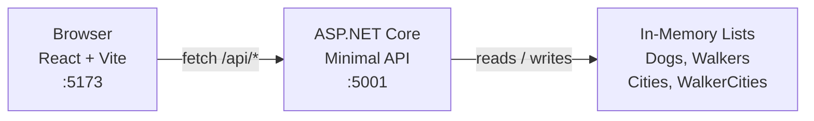
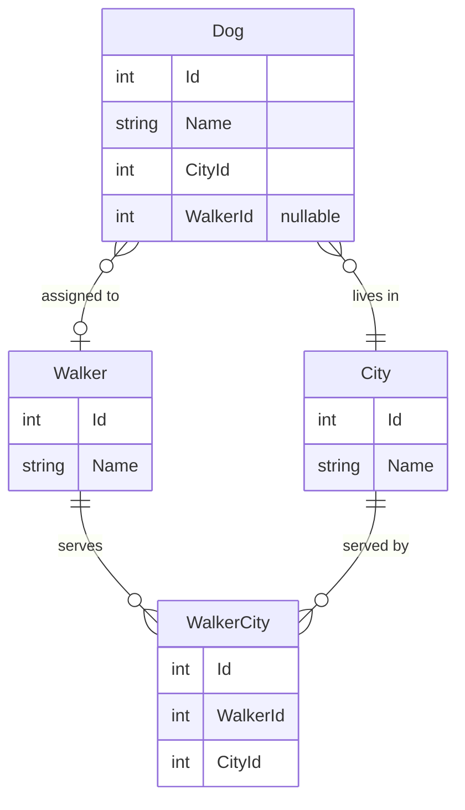

<!-- Last updated: 2026-05-15 -->
<!-- Last change: Initial architecture document -->

# DeShawn's Dog Walking - Technical Architecture

## System Overview

A single-page React app talks to an ASP.NET Core Minimal API over HTTP. All data lives in in-memory lists defined in `Program.cs`. There is no database.



The Vite dev server proxies all `/api/*` requests to the .NET backend at `https://localhost:5001` (configured in `client/package.json`).

## Component Breakdown

### Backend: `Program.cs`

All route handlers live directly in `Program.cs`. There are no controllers. Data is stored as `List<T>` variables declared at the top of the file. Entity classes live in a `Models/` folder and are imported via `using`.

### Frontend: `client/src/`

| File / Folder | Responsibility |
|---|---|
| `index.jsx` | App entry point; defines all routes |
| `App.jsx` | Shell component: navbar + `<Outlet />` |
| `apiManager.js` | All `fetch` calls; one exported function per API operation |
| `components/dogs/` | Dog list, dog detail, add-dog form, walker assignment UI |
| `components/walkers/` | Walker list with city filter, manage-cities form |
| `components/cities/` | Add-city form |

### Data: In-Memory Lists

Four lists are declared at the top of `Program.cs` and seeded with sample data:

```csharp
List<Dog> dogs = [ ... ];
List<Walker> walkers = [ ... ];
List<City> cities = [ ... ];
List<WalkerCity> walkerCities = [ ... ];
```

Route handlers mutate these lists directly. Data resets on every server restart.

## Data Model



**Entity classes** live in `Models/`. Each class maps directly to its list entry:

- `Dog.cs`: `Id`, `Name`, `CityId`, `WalkerId` (nullable `int?`)
- `Walker.cs`: `Id`, `Name`
- `City.cs`: `Id`, `Name`
- `WalkerCity.cs`: `Id`, `WalkerId`, `CityId`

Navigation properties (e.g., `Walker.Cities`) are NOT on the entity classes. The route handlers join lists manually using LINQ.

## API Design

All routes are prefixed with `/api`. There is no authentication.

| Method | Route | User Story | Notes |
|---|---|---|---|
| GET | `/api/dogs` | 1 - View All Dogs | Returns dogs with `CityName` included |
| GET | `/api/dogs/{id}` | 2 - View Dog Details | Returns dog with `Walker` name included |
| POST | `/api/dogs` | 3 - Add Dog | Body: `{ name, cityId }` |
| DELETE | `/api/dogs/{id}` | 8 - Delete Dog | |
| PUT | `/api/dogs/{id}` | 5 - Assign Walker | Body: `{ walkerId }` |
| GET | `/api/walkers` | 4 - View Walkers by City | Optional `?cityId=` query param |
| DELETE | `/api/walkers/{id}` | 9 - Delete Walker | Also sets `WalkerId = null` on associated dogs |
| GET | `/api/walkers/{id}/cities` | 7 - Manage Walker Cities | Returns walker + their current cities |
| PUT | `/api/walkers/{id}/cities` | 7 - Manage Walker Cities | Body: `int[]` of cityIds; replaces existing entries |
| GET | `/api/cities` | 4, 3, 7 (dropdowns) | Returns all cities |
| POST | `/api/cities` | 6 - Add City | Body: `{ name }` |

**Query string pattern** (user story 4): `GET /api/walkers?cityId=2` filters walkers to those who have a matching entry in `walkerCities`. Without the query param, all walkers are returned.

**Delete Walker cascade** (user story 9): the handler must loop through `dogs` and set `WalkerId = null` for any dog where `WalkerId == id` before removing the walker from the list.

## Routing (Frontend)

Routes are defined in `index.jsx` as nested children of the `App` shell route.

| Path | Component | User Story |
|---|---|---|
| `/` | `DogList` | 1 - View All Dogs |
| `/dogs/:id` | `DogDetails` | 2 - View Dog Details, 5 - Assign Walker |
| `/dogs/add` | `DogForm` | 3 - Add Dog |
| `/walkers` | `WalkerList` | 4 - View Walkers by City |
| `/walkers/:id/cities` | `WalkerCities` | 7 - Manage Walker Cities |
| `/cities/add` | `CityForm` | 6 - Add City |

The "Assign Walker" UI (user story 5) lives on the `DogDetails` page: a dropdown of walkers in the dog's city and a save button.

The "Delete Dog" and "Delete Walker" buttons live on the detail/list pages that already show those items.

## Infrastructure & Deployment

This is a local development project only. No deployment target.

- .NET backend runs on `https://localhost:5001` via `dotnet run`
- React dev server runs on `http://localhost:5173` via `npm run dev` (inside `client/`)
- Vite proxies `/api/*` to the .NET backend automatically

## Project Conventions

### Code Organization

- All route handlers in `Program.cs`; no separate controller files
- Entity classes in `Models/` with one file per class
- All API fetch functions exported from `client/src/apiManager.js`
- React components in `client/src/components/` organized by feature: `dogs/`, `walkers/`, `cities/`

### Component Pattern

Follow the pattern established in `Home.jsx`:

```jsx
export default function MyComponent() {
  const [data, setData] = useState([]);

  useEffect(() => {
    fetchSomething().then(setData);
  }, []);

  return ( /* JSX */ );
}
```

### Git Workflow

- One feature branch per user story: `feature/1/view-all-dogs`, `feature/2/view-dog-details`, etc.
- PRs reference the issue number so GitHub auto-closes them on merge
- Work stories in order; each branch is cut from `main` after the previous PR merges
